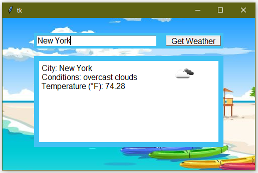

 
 

 
<!---->
 
 
# Check Weather Forecast with GUI 

In this class, you'll learn how to check weather forecast with GUI using python                                                            

  
 

  

## Prerequisites:

1.  <b> Python Basics </b>
2.  <b> tkinter module </b>
3.  <b> tkinter.ttk module </b>

---

